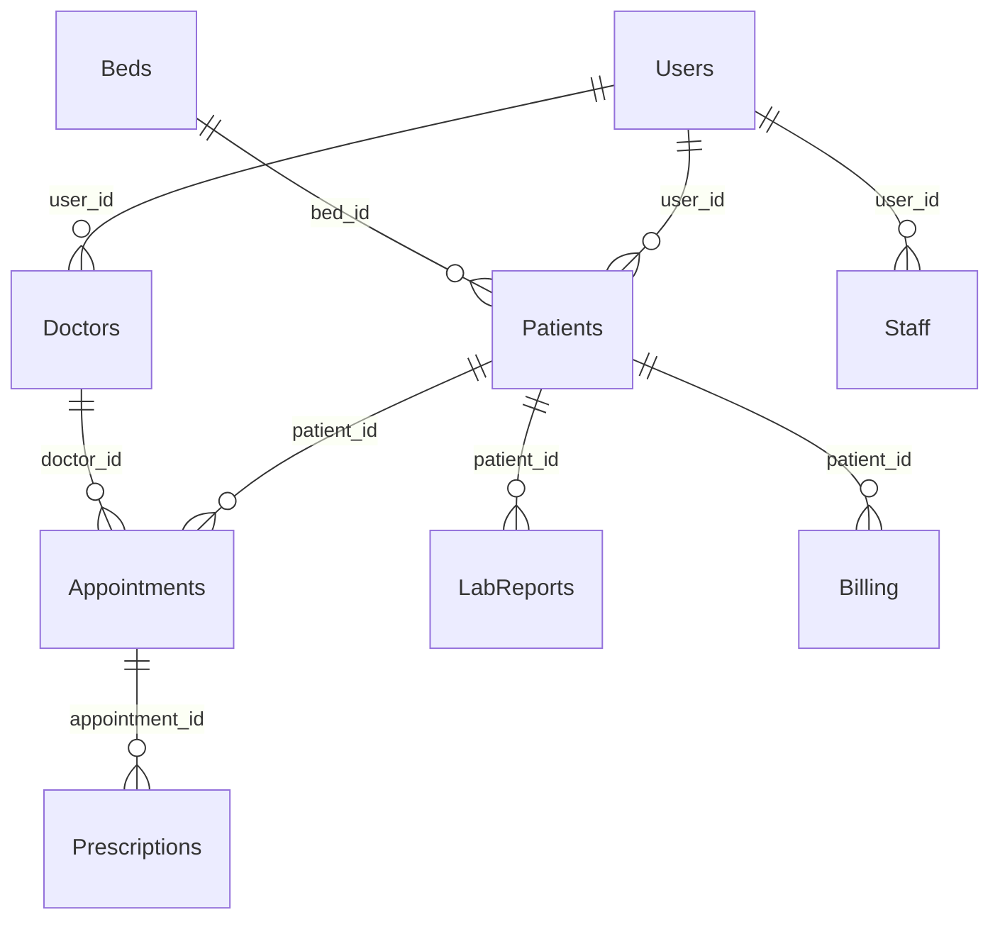

# System Architecture

## Overview

The Hospital Management Platform is built using modern web technologies with a clear separation between frontend and backend services. The architecture is designed for scalability, maintainability, and security.

## Technology Stack

### Frontend
- **Framework**: React 19.2.4 with Vite
- **Routing**: React Router DOM 7.13.1
- **State Management**: Zustand 5.0.11
- **Styling**: Tailwind CSS 4.2.1
- **Forms**: React Hook Form 7.71.2 with Zod validation
- **Charts**: Recharts 3.8.0
- **Testing**: Vitest 4.1.0 with Testing Library

### Backend
- **Framework**: FastAPI 0.115.6
- **Server**: Uvicorn 0.32.1
- **Database ORM**: SQLAlchemy 2.0.36 (async)
- **Database**: PostgreSQL (with AsyncPG driver)
- **Authentication**: JWT with python-jose
- **Password Hashing**: Passlib with bcrypt
- **Migrations**: Alembic 1.14.0
- **Testing**: Pytest 9.0.2

### Infrastructure
- **Frontend Hosting**: Vercel
- **Backend Hosting**: Render
- **Database**: PostgreSQL on Render
- **CI/CD**: GitHub Actions
- **Monitoring**: Built-in platform monitoring

## System Components

### Frontend Architecture

```
src/
├── components/          # Reusable UI components
├── layouts/            # Page layout components
├── pages/              # Route components
│   ├── dashboard/      # Patient dashboard pages
│   └── hms/           # HMS portal pages
│       ├── admin/     # Admin interface
│       ├── doctor/    # Doctor interface
│       └── reception/ # Reception interface
├── services/          # API services
├── store/             # State management
└── utils/             # Utility functions
```

### Backend Architecture

```
app/
├── core/              # Core configurations
│   ├── config.py      # Application settings
│   ├── database.py    # Database configuration
│   ├── deps.py        # Dependencies
│   └── security.py    # Security utilities
├── middleware/        # Custom middleware
├── models/            # SQLAlchemy models
├── routers/           # API route handlers
├── schemas/           # Pydantic schemas
└── services/          # Business logic
```

## Database Schema

### Core Entities

1. **Users** - Base user authentication
2. **Patients** - Patient information and medical records
3. **Doctors** - Doctor profiles and specializations
4. **Staff** - Administrative and support staff
5. **Appointments** - Scheduling and management
6. **Prescriptions** - Medical prescriptions
7. **Lab Reports** - Laboratory test results
8. **Billing** - Financial transactions
9. **Inventory** - Medical supplies and equipment
10. **Beds** - Hospital bed management

### Relationships



## API Design

### RESTful Endpoints

- **Authentication**: `/api/auth/*`
- **Users**: `/api/users/*`
- **Patients**: `/api/patients/*`
- **Doctors**: `/api/doctors/*`
- **Appointments**: `/api/appointments/*`
- **Billing**: `/api/billing/*`
- **Inventory**: `/api/inventory/*`
- **Lab Reports**: `/api/lab/*`
- **Admin**: `/api/admin/*`

### Authentication Flow

1. User login → JWT token issued
2. Token included in Authorization header
3. Middleware validates token on protected routes
4. Role-based access control (RBAC)

## Security Architecture

### Authentication & Authorization
- JWT-based authentication
- Role-based access control (Admin, Doctor, Reception, Patient)
- Secure password hashing with bcrypt
- Protected routes with middleware

### Data Protection
- Input validation with Pydantic
- SQL injection prevention with SQLAlchemy ORM
- CORS configuration
- Environment-based configuration

### Security Headers
- Content Security Policy
- X-Frame-Options
- X-Content-Type-Options
- Secure cookie settings

## Deployment Architecture

### Production Environment

```
┌─────────────────┐    ┌─────────────────┐
│     Vercel      │    │     Render      │
│   (Frontend)    │────│   (Backend)     │
│                 │    │                 │
│  React SPA      │    │  FastAPI App    │
│  Static Assets  │    │  Python Server  │
└─────────────────┘    └─────────────────┘
                              │
                       ┌─────────────────┐
                       │     Render      │
                       │  (PostgreSQL)   │
                       │                 │
                       │   Database      │
                       └─────────────────┘
```

### Development Environment

```
┌─────────────────┐    ┌─────────────────┐
│   localhost     │    │   localhost     │
│   :3000         │────│   :8000         │
│                 │    │                 │
│  Vite Dev       │    │  Uvicorn Dev    │
│  HMR Enabled    │    │  Auto Reload    │
└─────────────────┘    └─────────────────┘
                              │
                       ┌─────────────────┐
                       │   localhost     │
                       │   :5432         │
                       │                 │
                       │  PostgreSQL     │
                       └─────────────────┘
```

## Performance Considerations

### Frontend Optimization
- Code splitting with React.lazy()
- Bundle optimization with Vite
- Image optimization
- Caching strategies

### Backend Optimization
- Async/await database operations
- Connection pooling
- Query optimization
- Response caching
- Pagination for large datasets

### Database Optimization
- Proper indexing
- Foreign key constraints
- Query optimization
- Connection pooling

## Scalability

### Horizontal Scaling
- Stateless backend design
- Database connection pooling
- CDN for static assets
- Load balancer ready

### Vertical Scaling
- Resource monitoring
- Auto-scaling capabilities on cloud platforms
- Database performance tuning

## Monitoring & Logging

### Application Monitoring
- Error tracking and reporting
- Performance monitoring
- Uptime monitoring
- User analytics

### Logging Strategy
- Structured logging with Loguru
- Log levels (DEBUG, INFO, WARNING, ERROR)
- Request/response logging
- Security event logging

## Future Enhancements

### Planned Features
- Real-time notifications
- Mobile application
- API rate limiting
- Advanced analytics
- Integration with medical devices
- Telemedicine capabilities

### Technical Improvements
- Microservices architecture
- Event-driven architecture
- Advanced caching (Redis)
- Full-text search (Elasticsearch)
- Container orchestration (Kubernetes)

## Development Workflow

### Code Quality
- ESLint for JavaScript/React
- Type checking with PropTypes
- Code formatting with Prettier
- Pre-commit hooks
- Automated testing

### CI/CD Pipeline
- GitHub Actions for automation
- Automated testing on pull requests
- Automated deployment to staging
- Manual approval for production deployment

## Documentation

- API documentation with FastAPI/Swagger
- Component documentation with Storybook
- Architecture decision records (ADRs)
- Deployment guides
- User manuals